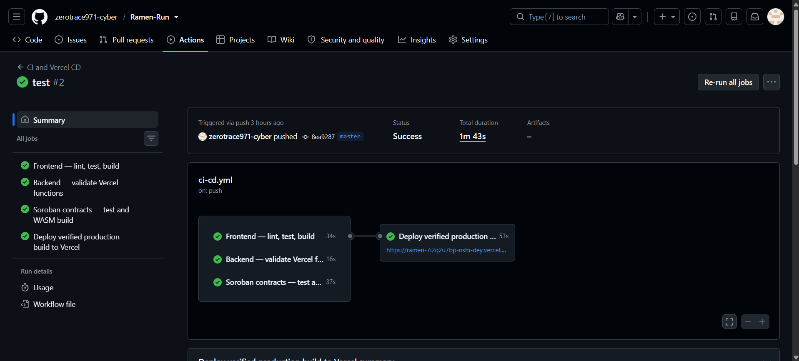
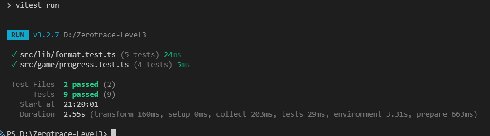
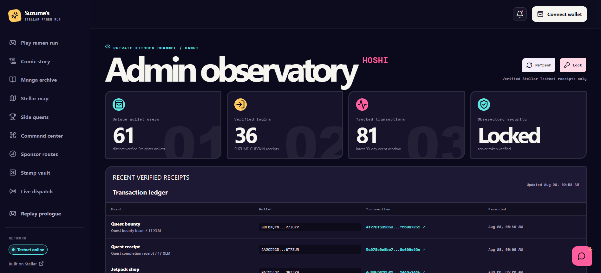
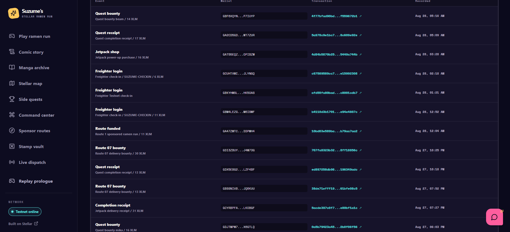
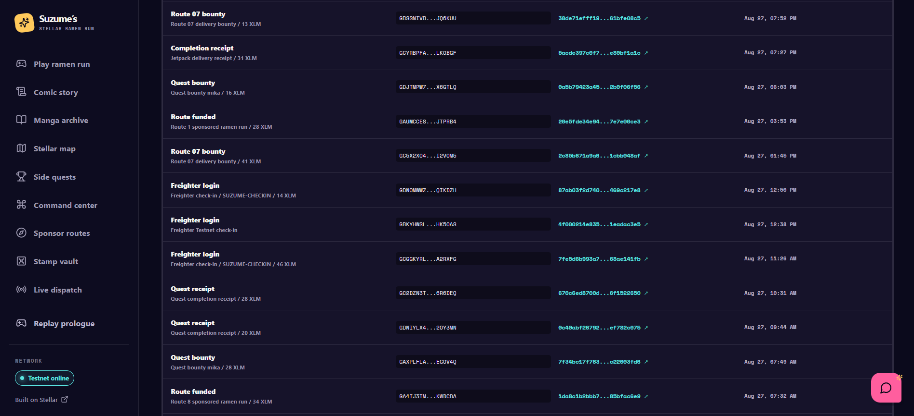
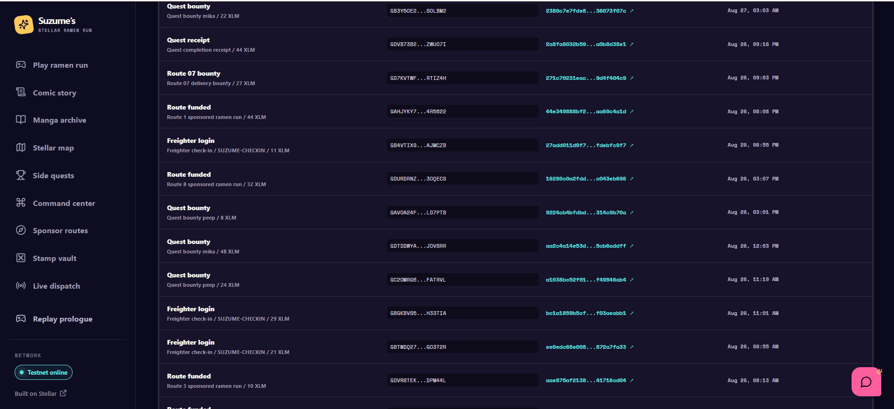

# Suzume’s Stellar Ramen Run 🍜 ✦

> A comic-book Stellar dApp where a player sponsors cosmic ramen deliveries, tracks their route live, and earns a permanent on-chain achievement stamp when the order lands.


## Why this is more than a demo

Suzume’s Stellar Ramen Run is a full-stack, responsive Soroban project designed around a small but realistic two-contract workflow:

```text
Freighter wallet → Ramen Vault → Stamp Shelf
                     │              │
                     └── events ────┴──→ SSE relay → live dispatch UI
```

- **Ramen Vault** accepts a sponsored route, validates its state, holds its record, emits typed events, and can complete a route.
- **Stamp Shelf** is a separate contract that only accepts a delegated authorization from the configured Vault. A completed route triggers a cross-contract call that mints an owner/route/rarity/serial achievement record.
- **Live Dispatch** consumes an SSE feed. It has a polished simulated live feed in demo mode, then switches to a real relay through `VITE_EVENT_STREAM_URL` after deployment.
- **Suzume** is a Gemini-ready assistant. Its API key is only read by `api/suzume.mjs`; without a key, the UI keeps working through an intentionally helpful local concierge fallback.
## Contract Address

GDBGZXECSRHPO4EVUPWYKBPOTYOMTULD2VYG7ESFIBWIVXRFLRWASD7S

## Live Website Link

https://ramen-run.vercel.app

## Screenshots


## Mobile Responsive UI


## Demo Video Link

https://drive.google.com/file/d/1g5c6llwaG9J6xqqPYUZ3q_EuiKacKjKS/view?usp=sharing

## CI CD working pipeline for Level 4

The GitHub Actions pipeline completed the frontend lint/test/build, backend Vercel-function validation, Soroban contract tests/WASM build, and verified Vercel production deployment.



## Test passed

Frontend unit tests completed successfully: 2 test files and 9 assertions passed.



## User onboarding

### User onboarding proof

The project was tested by **62 onboarded users** across the July–August 2026 review period. Each participant supplied a Stellar wallet address, rated the dApp, and shared direct product feedback. Later onboarding sessions also captured transaction hashes, providing on-chain evidence that users completed Stellar-powered interactions.

The complete source sheet is available in the [user onboarding proof spreadsheet](https://docs.google.com/spreadsheets/d/1iPndsoznlr07PqpgE-uWWfDu9Tp-oy2GhCo4GjcZ_gw/edit?usp=sharing).

<details>
<summary><strong>View all 62 onboarding responses</strong></summary>

> Feedback is reproduced as submitted and may contain informal language.

| Timestamp | Name | Email ID | Stellar wallet address | Rating (1–5) | Feedback | Transaction receipt |
| --- | --- | --- | --- | ---: | --- | --- |
| 29/07/2026 13:41:35 | seyit ali | degirmenseyit@gmail.com | `GDOCMYNNTH62NW37IZCN6BKQTM5Z73RW7OOFXRADLYXUABDN3UXWDTNC` | 5 | A great idea that clearly involved a lot of hard work. | — |
| 29/07/2026 13:49:14 | Bekir Erdem | l3ekirerdem@gmail.com | `GBGHSPQEIZGJOJJDJYG5VVIPU7THJQU2Z4B6V5VF5IHUQ2SOLIRITDQS` | 5 | sponsor bölümünde işlemler hata veriyor. arayüz biraz karmaşık geldi bence ux iyileştirmesi olması lazım. oyun oynarken eğlendim birden hata alıp sonlanıyor oyun. | — |
| 29/07/2026 15:27:50 | Arijit Debnath | arijitdebnath008@gmail.com | `GDBHMNAQ5CRSNNSHIVJRM3OGMIX3TS3VR2J5SHFUKPGDZDCMBXAVMONK` | 5 | SPEECHLESS | — |
| 29/07/2026 15:35:13 | Nitin Raj | nraj50745@gmail.com | `GARRE4DTEUJIQSXRACCL6X55RH42S7WBO32F5HB4DU32MT6IL5TL3B3N` | 5 | great | — |
| 29/07/2026 17:33:21 | Deep Saha | ideepsaha25@gmail.com | `GDIBWMLXW453K5AT4DI7EKPUQBUBPAMLPDN32NLUOKBHQH7EJYPCZCH3` | 5 | super cool app | — |
| 29/07/2026 18:01:46 | Amitabh Dey | amitabhdey101@gmail.com | `GBKYHWSL2MNUO73HWY6KWNOA64AKSUENCOBTR56M66HNLMMKMZHK5OAS` | 5 | you might be my younger brother but still u r making better products than me...proud of you | (https://stellar.expert/explorer/testnet/tx/df23f7b3202ff5c52b000d346216948b96eab4528ddc2ed5a2191b4c121ada2b) |
| 29/07/2026 18:49:03 | sujan mandal | sujanmandal2525@gmail.com | `GABHLJSUU3HSYQMAADRQG3OUWBUK6BTY4JTBLLXY5WDS3QBBK7FJENCP` | 5 | i got an orgasm after playing it for the first time . | — |
| 29/07/2026 19:14:51 | Sk Jishan Uddin | j2097138@gmail.com | `GAVVOOVYGE7QEJWQO2BZZBGYYSFQPBC3QAYWRC6AFP7E3UMCWFT6YC4U` | 5 | Amazing game app! The app is smooth, easy to use, and the gameplay is really fun. I love the clean interface and fast performance with no lag. It's clear that a lot of effort went into building this app. Looking forward to more updates, new features, and exciting games. Highly recommended to anyone who enjoys mobile gaming. Great job! 👏🎮 | — |
| 29/07/2026 20:29:41 | Ankush Shaw | ankushshaw764@gmail.com | `GBBIG4HLPGTLG6BH6YREVWJXEQ4NX74HTD444JD6A6XYS7DOFL2J6DEI` | 4 | me nhi deta feedback jaa | — |
| 29/07/2026 20:48:31 | Subhadip Dutta | subhadipduttads@gmail.com | `GAVNLCS3GSWLKXSLZ3ITSL7QNB5IGHEOELXAF6QTYACDLEJ7XRQKBBNO` | 5 | Impressive performance .Great gaming experience. | — |
| 29/07/2026 21:05:14 | Ritam saha | poppritu@gmail.com | `GACMLTEWZ23NGJ5WZ2THYGLODFYTEKECB7J2U33H3DCSW2PEAQUEIZED` | 4 | fantastic | — |
| 02/08/2026 21:41:28 | Ayushman Chakraborty | ayushmanc67@gmail.com | `GAMJDZNNSFSUU5Q6ZXS56TSIOLZ4P6NL6A4X7VPNIGVNDBKQWUFSXO4V` | 5 | Pretty Cool | — |
| 25/08/2026 00:05:18 | Abhishek Verma | abhishek915verma@gmail.com | `GASCOQFKJHC7MPOMTARJPBQTZ5YKEBCWGTFQGGI7DPBXKZ7T7PHZTVIK` | 5 | damnnn bro...u r strong and so is the app | [26567c37…94ea70](https://stellar.expert/explorer/testnet/tx/26567c37795ed2e674500a0545e96faca63ca4117409c62029c4147c2d94ea70) |
| 25/08/2026 00:28:43 | Pooja Saxena | poojasaxena74@gmail.com | `GD3WOP3HDNZ6WSY7IUYJYL345WYRBFM7X3HO7SAKLZJVOXRMA5NUNJJU` | 4 | good creativity | [11adfe82…e3617f](https://stellar.expert/explorer/testnet/tx/11adfe8273d0b05aa501ac9bb11ab2d525b7c96b97212dffbf25cd5af4e3617f) |
| 25/08/2026 02:01:54 | Upasana Poddar | upasana816poddar@gmail.com | `GATIIYZAPP3LCDGDUQ5HMJCJLA5RL6CCZLC4KZCEACHOANL6V5VEQBLQ` | 5 | 123456789 f you | [3f5ef225…f2d312](https://stellar.expert/explorer/testnet/tx/3f5ef225812c6b964c0b57111715f808b2ae24a66112179597343816fef2d312) |
| 25/08/2026 02:58:19 | Roshni Sharma | roshnisharma83@gmail.com | `GDVMSCYAWJ4UAVEW67DSHH2U77RQH6BHIVHE74VR3CMORSW64SPRAF4L` | 5 | really nic | [186252ed…6c948f](https://stellar.expert/explorer/testnet/tx/186252ed327652e925065cd5f72691ff517c7e0bf50f059f44b57a54e46c948f) |
| 25/08/2026 06:04:54 | Alok Verma | alok84verma@gmail.com | `GAZ6BTZXZXTTGXRHVHMIBLW74G2H6IG2FJQXAPXBETK644YCAHSFNGLA` | 5 | good graphics | [d5a016d2…976490](https://stellar.expert/explorer/testnet/tx/d5a016d211974c7758dbeb71bf02b3d6a1e0168720a299ca89d7c1de2d976490) |
| 25/08/2026 07:23:42 | Simran Chauhan | simran47chauhan@gmail.com | `GCMBTAZZGZUGDR6L5G5TR7GEU64VGVEXE4O2XZIW3OVE7PKLUYWJY552` | 4 | keep it up | [cdc93275…7a66ae](https://stellar.expert/explorer/testnet/tx/cdc9327561fc3c23f5f9219714f2deeaa612c94c0b7b3b6b1cf83838cf7a66ae) |
| 25/08/2026 09:09:50 | Neha Agarwal | nehaagarwal841@gmail.com | `GAFCNBDGCHVCBCD2OGGB7MLR2WK3REZPXLSNNLKFUWVN4VW42MOYSCOQ` | 4 | beta tumse nhi hoga | [91e9ef75…ce6f0f](https://stellar.expert/explorer/testnet/tx/91e9ef75b7a1f01b8597ecd3f1a62e2326b968dd707c68be5c5630a0d9ce6f0f) |
| 25/08/2026 11:46:51 | Partha Sarkar | parthasarkar829@gmail.com | `GC3J6VBY5J6KCO5Q44LA4HMXQUSRSEUOUOZ72AUELFHI4WZQCGJXV3SM` | 5 | add some bosses dude | [b90a40cb…c4fc58](https://stellar.expert/explorer/testnet/tx/b90a40cbeceb8c6fad80101e47b5ace70c3a25d1a7449ec66af67ee933c4fc58) |
| 25/08/2026 12:23:40 | Harsh Bhatia | harsh482bhatia@gmail.com | `GDQSDMYJYZUD2EJATDO5H5YQUJYCA4MVXB5J4KGBA6EWULRFAQ33SIRL` | 5 | nice work | [3263c318…86d6a2](https://stellar.expert/explorer/testnet/tx/3263c31858bf1ed2ac9b8a19569ecc75efe51dcd4c9906f7e450633c4486d6a2) |
| 25/08/2026 12:40:59 | Piyali Choudhury | piyalichoudhury38@gmail.com | `GAC4KHDR532II3NB4EPN2VQSQTMLY4DWLKX4XRBC3INRRO7AMFEVWG7H` | 5 | dada khub shundor hoyeche | [8455aae3…8d2d8a](https://stellar.expert/explorer/testnet/tx/8455aae326a92197367295966b66057f833390522f0da09d342bb76b728d2d8a) |
| 25/08/2026 13:15:11 | Vivek Sharma | vivek748sharma@gmail.com | `GAL5Z3ZGSOJ5XOMWSPMFWTWIHEKGL5JMYLBMDYF6YNTDO6KVV75HKK7T` | 5 | good | [23fc28d5…e207a4](https://stellar.expert/explorer/testnet/tx/23fc28d5f72f41f1f2c91b866ab4c1c2c587e319001d42b8336f67b78ce207a4) |
| 25/08/2026 15:51:10 | Niharika Agarwal | niharika903agarwal@gmail.com | `GBHMZXGHIS3BW244F66KR6CSZ6A2ZXYDROQIEEDSJUVQVRLF6XNIUSYB` | 4 | the app in entire is good | [c8136429…93dc44](https://stellar.expert/explorer/testnet/tx/c8136429e79948ea1ba7fb3ca1a8e412368245265982d1091f9cc8b06993dc44) |
| 25/08/2026 16:45:30 | Mohit Saxena | mohit934saxena@gmail.com | `GBTTIABS3IOS25C6ZXVNAORW5KCKFUIP3BLBD24NQMQQFRZ2S6T37724` | 4 | nice | [9d84af98…f6d057](https://stellar.expert/explorer/testnet/tx/9d84af9894a99378da5def07bc9fe446202dc19f08ce35956fd1ca3795f6d057) |
| 25/08/2026 17:48:37 | Tanya Rastogi | tanyarastogi49@gmail.com | `GBOP7APK4LFHSUOMC5OXUI4H37CECOUIZYNRY6FGALRE5QJCZN5QH3Z4` | 5 | still not so good fix the ui | [a7678504…46b612](https://stellar.expert/explorer/testnet/tx/a7678504d2576d8caa3dac25ba83d228dea81348ad2f999f32208910da46b612) |
| 25/08/2026 22:17:28 | Rahul Singh | rahulsingh391@gmail.com | `GB43BOUYDRLP636463J7NRJX2UM2QSS7OCAPGXIKANKQQU4J3VRRPOEM` | 4 | the wallet is getting stuck while payout of the reward pls fix it | [d1181b94…6d8b72](https://stellar.expert/explorer/testnet/tx/d1181b9434ad942aebb8e2dd21376ee7dc0b7e87bd25adda648f4e45ae6d8b72) |
| 25/08/2026 22:29:12 | Atasi Ghosh | atasighosh163@gmail.com | `GBS4JU44NM4I4773VVD4CHGY7VA332X2JXX5FLTYBCR65BIIAZ7CKIJS` | 5 | nice bro | [0522fd81…a687f7](https://stellar.expert/explorer/testnet/tx/0522fd817ac671ba502bc2f33affd079114601b7210f2570bf165b5be8a687f7) |
| 25/08/2026 23:55:58 | Karan Tyagi | karan81tyagi@gmail.com | `GAAYADYE6HLXTH32IVG3Q5KD54TGMDE3NYJJL5NPKNJWZVBGT33N775F` | 1 | bekar h | [85c512a0…2110f1](https://stellar.expert/explorer/testnet/tx/85c512a0abafc56cb0a3c0d429103a3db4028da9b10462f3ca5e07ab442110f1) |
| 26/08/2026 00:43:06 | Tarun Grover | tarun281grover@gmail.com | `GDBQ5OFKTRZA6F3KK7SYWBWLQ2TN3ANZLE2BHHQLYBWNH6W55OISXQA5` | 5 | safsdffsfd | [0c308327…400cfe](https://stellar.expert/explorer/testnet/tx/0c308327f28704ba2d15ca3b04a8b7910cb845af8b3848d11a18ddb661400cfe) |
| 26/08/2026 02:43:03 | Suchismita Bhowmick | suchismita83bhowmick@gmail.com | `GDVRSTEKMQYUOZ2ELDLM3Y43XZ67JKMEYAOFXL2LFM47E7YHUXDPM44L` | 5 | the design is og | [aae875af…16cd04](https://stellar.expert/explorer/testnet/tx/aae875af213853640fdef8cf0d86d6ca7f5ec1bc969d0be1a25de5241716cd04) |
| 26/08/2026 03:25:25 | Gaurav Singh | gaurav618singh@gmail.com | `GBTWDQ27PPHFG4Y75TFPCXGJDUSX3IUOQOGHQIIYGG55YBJSGBGO3T2R` | 1 | faaahh..no feedback | [ee0edc68…a7fa33](https://stellar.expert/explorer/testnet/tx/ee0edc68e008724da3532d7b815056a9feff26e9a7d97bc2392f52f872a7fa33) |
| 26/08/2026 05:31:34 | Bratati Basak | bratati639basak@gmail.com | `GBGKBVS55WSEGLRHAHZZIH3Z7GP7ULVDA75VPFOZJT7PZIMNVGH33TIA` | 5 | very very very very good | [bc1a1859…aeabb1](https://stellar.expert/explorer/testnet/tx/bc1a1859b5cf0066f311dea68c02b5590a5fe4f1d519ce6b4949628f03aeabb1) |
| 26/08/2026 05:49:06 | Divya Rastogi | divyarastogi604@gmail.com | `GC2OMRG6Y2HKX7FD2NPNQ4BFN5C24F3EXLNWJAD3RCLMH7JMQDFATRVL` | 5 | anata gambare gambare | [a1038bc5…546ab4](https://stellar.expert/explorer/testnet/tx/a1038bc52f015e62dbce56b4988040e329c08dba5af8d61ea1318fbf49546ab4) |
| 26/08/2026 06:33:25 | Sreelekha Kar | sreelekhakar75@gmail.com | `GDTDDWYAUUS6BPJJPMMGHQ2VUGEMJCHQMWY3SDTDZG5VID5NCKJOVSRR` | 2 | i dont like it its too much vibe coded | [aa2c4a14…6addff](https://stellar.expert/explorer/testnet/tx/aa2c4a14e53dff705cc38ccd79a9ba43c23cb9a8f857e4def16d76c5cb6addff) |
| 26/08/2026 09:31:39 | Kriti Pandey | kritipandey602@gmail.com | `GAVOA24FPGSIITFYXB4FA6763547TVFTAZNOQHN4PUTJKQPDPPLD7PTB` | 4 | aami to obak hoyegelam | [9224cb4b…c9b70a](https://stellar.expert/explorer/testnet/tx/9224cb4bfdbda06c0576f6ab4b6497d99c8c578f33b16093331bcbb314c9b70a) |
| 26/08/2026 09:37:09 | Tanushree Das | tanushreedas823@gmail.com | `GDURDRNZZYBTGNFKA5QRBEWWHYLIZAAKTNIZSTEYN6V32WF6BX3OQECS` | 4 | why aint u replying me | [16280c0a…3eb696](https://stellar.expert/explorer/testnet/tx/16280c0a2fdd6407854529a66075f5e768c7ce75beeee7676d4ba55c043eb696) |
| 26/08/2026 13:25:46 | Tamalika Sengupta | tamalikasengupta294@gmail.com | `GB4VTIXSMFOZ7JMXG2626QXOCQTVU5J43HH7DO3JLZM7T7FF5TAJMCZB` | 3 | the way you made it comical is applaudible | [27add011…bfc9f7](https://stellar.expert/explorer/testnet/tx/27add011d9f7461617bf969ce3d75a9dd64b62f1810c9404d3a269efdebfc9f7) |
| 26/08/2026 14:38:15 | Sharmistha Nandi | sharmisthanandi92@gmail.com | `GAHJYKY7SCVEANZ6IEUPY5OR3QXJRRQDMMOQIL32DB4IJUE34E4R5622` | 4 | it can be better contact me if u need some ux expert | [44e34988…9c4a1d](https://stellar.expert/explorer/testnet/tx/44e349888bf26dae341e6c1e094424a08d5a2bdfdd34999b409825faa69c4a1d) |
| 26/08/2026 15:33:55 | Barnali Dasgupta | barnalidasgupta375@gmail.com | `GD7KVTWF46VMKWDZYUSIN6QKEZJIZ3DQX4IRVLXHM5XMJRH722RTIZ4H` | 4 | the levels are too boring | [271c7023…f404c9](https://stellar.expert/explorer/testnet/tx/271c70231eac4d2ed45c092e06dfd3248a89273b58a08cef87f22929d4f404c9) |
| 26/08/2026 15:46:45 | Ritu Joshi | ritu614joshi@gmail.com | `GDVB73B2YXZES3LLWKMVO7D2YYMVZ55FGULOJ43VQK4PPFXZ63ZWUO7I` | 5 | really cool | [2a8fa603…8d38e1](https://stellar.expert/explorer/testnet/tx/2a8fa6032b59f8e14f2de356161adb9013805c8cfe4f189eade63b6a0b8d38e1) |
| 26/08/2026 21:33:19 | Soumik Samanta | soumiksamanta702@gmail.com | `GB3Y5OE2UQFJDD3O7LWKX3WDSB2XFJMB7SBCPB544ERL4RDVFOSOLBM2` | 5 | good | [2380c7e7…73f07c](https://stellar.expert/explorer/testnet/tx/2380c7e7fde8afa0fe503cd85612bc5216ec067c40742875234203136073f07c) |
| 26/08/2026 22:50:19 | Sayantani Chakraborty | sayantanichakraborty42@gmail.com | `GDDLVZ3POW6MVTJWFHUOL7ZK5XEWCIIIXSALR5FSKMAYABOC6V7CQKUH` | 5 | good game my bro | [d10dcb68…85a3d1](https://stellar.expert/explorer/testnet/tx/d10dcb6894df4c8debc20d08a5cb11cfb1c6473d96c533d0b1c9fbc00285a3d1) |
| 27/08/2026 02:02:58 | Rumela Mullick | rumelamullick847@gmail.com | `GA4IJ3TMW6WXXSYTG5QY65C65JP2BF4E3C27YL2NDR3L7334TKKWDCDA` | 5 | fantastic | [1da8c1b2…fac6e9](https://stellar.expert/explorer/testnet/tx/1da8c1b2bbb71b925182d92b363cf974f9b145e8fef15dfe37f6a6a85bfac6e9) |
| 27/08/2026 02:19:21 | Sujoy De | sujoyde731@gmail.com | `GAXPLFLARONUFY2ITP4Y7ZO45LT35EO3ZGMXHUEJX6RLZ6Z2EHEGOV4Q` | 5 | can be better..the game itself can be improved | [7f34bc17…003fd6](https://stellar.expert/explorer/testnet/tx/7f34bc17f7635dbe48579a6e332263fa7f8cb1ac93dc6119939e7e7c22003fd6) |
| 27/08/2026 04:14:38 | Kaushik Roy | kaushikroy158@gmail.com | `GDNIYLX4MSBTT5GPY5CLKQ5RMZJFPYODZWG6IR25WHYMSQ4UTS2OY3MN` | 5 | nice nice | [0c40abf2…82c075](https://stellar.expert/explorer/testnet/tx/0c40abf26792d140e2d750e53071e7cfaf9a7aceb2d17ab32331c71ef782c075) |
| 27/08/2026 05:01:43 | Dipankar Sen | dipankar821sen@gmail.com | `GC2DZN3THJPN7CO5G3X5E6RWWFHZMACNO5DB5VEJ5FW5YDOISR6R6DEQ` | 4 | dammm...the ai is good but the design needs to be better | [670c6ed8…522650](https://stellar.expert/explorer/testnet/tx/670c6ed8700d617a093df68bb609bcf5561208b15dd283becb43e3b6f1522650) |
| 27/08/2026 05:56:22 | Debabrata Ganguly | debabrata419ganguly@gmail.com | `GCGGKYRLNT3KR4BUEIBMGEIXLB3FVRGOCA6QPVWI56HHETS2MMA2RXFG` | 4 | so cool shit | [7fe5d6b9…e141fb](https://stellar.expert/explorer/testnet/tx/7fe5d6b993a73edb5a149167242f2ffa0186ade181bb3b5c8fc195668ae141fb) |
| 27/08/2026 07:20:14 | Chirag Malhotra | chirag912malhotra@gmail.com | `GDNOMWWZ5NUA4SOUPUIO3DA2YMG3ZUU2RW47K6MP3YYAM5UB2RQIKDZH` | 5 | game is lagging a bit | [87ab03f2…c217e8](https://stellar.expert/explorer/testnet/tx/87ab03f2d740cd68a2ed6f41898e034dcc7e6847fe1f5dccaf87e82469c217e8) |
| 27/08/2026 08:15:47 | Mayank Bhatia | mayank206bhatia@gmail.com | `GC5X2XO4IZCJ7WW5FNDZL4NMOHEWB4UD4VKRFYKTZCJPJGTESXI2VOM5` | 5 | mind blowing | [2c85b671…b048af](https://stellar.expert/explorer/testnet/tx/2c85b671a9a65f59d2807b30204a5373dcd117c8da9dab5191e22d71cbb048af) |
| 27/08/2026 10:23:12 | Manisha Biswas | manishabiswas305@gmail.com | `GAUMCCESN3OCWKUSIBMHT5T5YC42ZDJP4IWOBVPP2YTKEYKWXQJTPRB4` | 2 | really commendable work | [20e5fde3…e00ce3](https://stellar.expert/explorer/testnet/tx/20e5fde34e94b7a39639341492289e7e2837fd0cd417de334a488117e7e00ce3) |
| 27/08/2026 12:33:48 | Arpita Banerjee | arpitabanerjee582@gmail.com | `GDJTMPW7UCBRIGASEAUABEPJWSSUVTR6YQBLPH4KUGFRFLWN6CX6GTLQ` | 5 | are amitabh er choto bhai darun to hobei | [0a5b7942…f06f56](https://stellar.expert/explorer/testnet/tx/0a5b79423a4557ab39cf0d88a67a6537d39b6e59b164cf4163b446b2b0f06f56) |
| 27/08/2026 13:57:16 | Saikat Mitra | saikat824mitra@gmail.com | `GCYRBPFAKTC3DYT74CCZYH463QQTQ7WFRM5PYQWBEIGBRJEGIQLKOBGF` | 4 | wow amazing | [5acde397…bf1a1c](https://stellar.expert/explorer/testnet/tx/5acde397c0f7a598e893f437e94289f37e38c84b26e1d36e54a0565e80bf1a1c) |
| 27/08/2026 14:22:28 | Arundhati Kundu | arundhatikundu182@gmail.com | `GBSSNIVB5VDPKKEBTH5LDIZJWEFTISOKYMKH3SMSPY73IDB36ZJQ6KUU` | 5 | good and brilliant characters | [38de71ef…fe08c5](https://stellar.expert/explorer/testnet/tx/38de71efff194117004406281090b22aced8a81cb834acf0a863a8b61bfe08c5) |
| 27/08/2026 16:48:49 | Sabyasachi Ghoshal | sabyasachighoshal17@gmail.com | `GDX5EBG2WRITE2ZZAIWLD3SJWEOPR7PZCOXWUKDUN6E4ZBUYX3LZF4BF` | 5 | shera hoyeche bro dekh transaction o korechi | [ed897258…349adc](https://stellar.expert/explorer/testnet/tx/ed897258db96d130d475469a86a07d29eff2052b1aa4e713df14d30196349adc) |
| 27/08/2026 16:55:12 | Varun Rathore | varun712rathore@gmail.com | `GDI3ZBUYHFZ3KGYQDPQ7VTZHTMV65S3TL6WZWNFF3WLCNKVNJKJ4M73G` | 3 | need some updates dude | [707fa832…18856c](https://stellar.expert/explorer/testnet/tx/707fa8323b32148acb32c4d11c4c6fe11366033a698de51a062b8cc8ff18856c) |
| 27/08/2026 18:34:26 | Manish Kapoor | manishkapoor519@gmail.com | `GA47ZWTCK5ZI6JVPZKHCNE7IDQDX4VSULGP5EMI63SRCQ4DZ5ODDPWH4` | 5 | really really good | [10bd03e5…aa7aa2](https://stellar.expert/explorer/testnet/tx/10bd03e589ba0e59284e2a3884c1d7c5e09b694dffe89f215db03cfb79aa7aa2) |
| 27/08/2026 19:22:57 | Pritam Dutta | pritam625dutta@gmail.com | `GBM4LEZGS3B3CNXYG5MXS5VSKSLHANPBKZCCU5H35TLKRATO37M6ISWF` | 5 | nice work and amazing experience | [b4110d3b…e4607c](https://stellar.expert/explorer/testnet/tx/b4110d3b1701f1e80422e76282d369cfb74857b7d1ff174677e80cee94e4607c) |
| 27/08/2026 20:48:53 | Nitin Malhotra | nitin257malhotra@gmail.com | `GCUHTXWINBY2MWBSG3RRVR3K4BUOSLMNNY4H24BDVND7TGIJUYJLYNGQ` | 5 | nice ui | [c9758958…992308](https://stellar.expert/explorer/testnet/tx/c97589589cc7b132e950bfa622ed0473b7e74dacd2f61d623332506e15992308) |
| 27/08/2026 21:58:10 | Kakali Mukhopadhyay | kakalimukhopadhyay61@gmail.com | `GAT55EQZAN3DQFEE6GRSJBN4I3RPAR5EZERPI3RWIQFTYOTPJNOPIBZW` | 3 | nice | [4d84b587…0a744b](https://stellar.expert/explorer/testnet/tx/4d84b5870b25312468c028a0b68b2066d711feecb2497edf6edbea55440a744b) |
| 27/08/2026 23:39:17 | Priya Sharma | priya394sharma@gmail.com | `GA2CD5GDPE6BBVM42XRRKS5TJJVCJ4OEIHDM3YODEAPLT5GDVBWT7ZUR` | 4 | great1 | [5a978c9e…09e92e](https://stellar.expert/explorer/testnet/tx/5a978c9e1bc7b69bbd8a818cadfc5a60ac40e8581a6e1f026d1a7c98c609e92e) |
| 27/08/2026 23:46:43 | Madhumita Bose | madhumitabose539@gmail.com | `GBF6XQYN2DLD7OK7HAJBSWBINO7I36PRJBX2E2PABKMUKHUHFSP7IUYP` | 3 | the backend systems are quite fast | [4f77bfad…9672b1](https://stellar.expert/explorer/testnet/tx/4f77bfad90bd1192f83f1b4aa7adcc7a9918704cb99efba7dbd68c8f559672b1) |

</details>

### User feedback form

New testers can continue sharing feedback through the [Suzume's Stellar Ramen Run feedback form](https://docs.google.com/forms/d/e/1FAIpQLSdbj6dke3pHTKVq0GFViyV5WfQhFMguQJlBGR4bGnCTTKyN1A/viewform).

### User Feedback Iteration

User testing was treated as an engineering input rather than a showcase-only metric. Early testers enjoyed the manga setting and core idea, but several recurring comments identified important weaknesses: the levels could feel repetitive or boring, the game sometimes ended too abruptly, the interface felt crowded, sponsor and reward actions needed clearer failure handling, wallet payouts could appear stuck, performance occasionally lagged, and the experience needed stronger challenges and a memorable boss.

Those observations led to a substantial gameplay and UX iteration:

| Feedback theme | Iteration shipped | Product result |
| --- | --- | --- |
| “The levels are too boring” and requests for stronger gameplay | Added district checkpoints, collectible ramen seals, Stellar sparks, near-miss scoring, combo multipliers, four Night Shift objectives, route grades, and three usable power-ups. | Runs now reward timing, route mastery, collection strategy, and replay improvement instead of simple repeated clicking. |
| Requests to “add some bosses” | Introduced the **Neko Shogun** encounter with animated character art, projectile patterns, dodge-to-counter combat, a live health bar, low-health visual feedback, and a boss-clear bonus. | Route 07 now has a distinct climax and a clear skill-based progression gate. |
| Abrupt crashes and frustrating run endings | Added a three-heart Broth Integrity system, brief post-hit invulnerability, shield protection, clearer collision feedback, and explicit retry states. | A mistake no longer ends a run immediately, giving players time to recover and understand what happened. |
| Complex or crowded interface | Reorganized the screen around a wide gameplay-first canvas, a route timeline, a dedicated objective panel, compact HUD cards, and a collapsed rooftop shop below the game. | Mission progress and controls remain visible while optional Testnet commerce stays secondary. |
| Wallet, sponsor, and payout confusion | Added explicit Freighter connection states, loading/error/success messaging, transaction receipt links, retry paths, and a clear distinction between local Broth Coins and optional Testnet XLM rewards. | Players can understand when an action is local, when Freighter approval is required, and where to verify an on-chain result. |
| Mobile and performance concerns | Tightened the canvas loop, reduced floaty control response, tested responsive ordering at mobile width, prevented horizontal overflow, and verified the browser console, lint, tests, and production build. | The game is more responsive on keyboard, pointer, touch, and small screens, with production checks guarding regressions. |

The result is not merely a visual refresh: feedback changed the game loop, failure model, progression system, Stellar transaction experience, and responsive information architecture.

### PPT Pitch Deck

The seven-slide project presentation is available here: [Suzume's Stellar Ramen Run pitch deck](https://docs.google.com/presentation/d/1m4ZRJMDLcLDgyF_7BJFgv0r2_AvZQogj/edit?usp=sharing&ouid=114462992243621177603&rtpof=true&sd=true).

## Feature tour

- A dedicated **Manga Archive** with six chapters and twelve illustrated pages, static cast compositions, chapter navigation, and opt-in Web Audio ambience for rain, kitchens, trains, lanterns, and the shrine finale.
- A generated sprite-art kit replaces gameplay emoji placeholders across Ramen Run and every side-quest arcade board, while the runner now has deeper neon lane lighting and impact effects.
- A playable three-lane Suzume courier arcade run: keyboard/tap movement, collectible stardust, hazards, hearts, combos, score targets, boosts, win/loss states, Web Audio sound effects, and local saved progression.
- A skippable, three-page manga prologue with four comic frames per page, generated anime key-art cast members, sound-effect typography, narration boxes, page-turn controls, and motion-driven reactions. The chapter view keeps the same moving, expression-tagged cast.
- Four genuinely different character arcade games: Yori’s **Laser Cat Chase** reaction grid, Chef Beam’s **Torii Nori Sorter** classification puzzle, Mika’s **Shinkansen Drift Duel** precision-steering challenge, and P.E.E.P.’s **Lantern Memory Heist** Simon-style memory game. They do not reuse the ramen-run mechanic.
- Responsive landing page, command center, route board, stamp vault, dispatch observatory, technical guide, settings, 404 page, loading, success, error, and wallet states.
- Freighter wallet flow: access approval, then a second Freighter prompt for a real tiny **Stellar Testnet self-payment** (`SUZUME-CHECKIN`) with an inspectable transaction hash.
- Testnet side-quest receipts: the included server function can pay a completed quest’s configured XLM bounty from a server-side Testnet treasury. Without a treasury, the game makes it explicit that the Freighter-signed fallback is a completion receipt, not an XLM reward.
- Typed contract events, narrow delegated authorization, role-gated administration, and three Rust contract tests.
- Frontend unit tests, linting, production build, GitHub Actions pipeline, deploy script, Vercel server function, and an SSE relay adapter.

## Quick start

Prerequisites: Node 22+, Rust stable, the `wasm32v1-none` target, and the Stellar CLI only when you are ready to deploy.

```bash
npm install
copy .env.example .env
npm run dev
```

Open the local Vite URL, select **Start the story**, then fund a route. With no contract IDs configured, the app runs safely in **demo mode** so every screen is presentation-ready.

For the game: use **↑ / ↓** or **W / S** to switch lanes, press **Space** to boost, collect ✦ and 🍜, and dodge ☄️. Mobile controls appear below the game stage.

## Environment variables

Copy `.env.example` to `.env`. Never expose Gemini credentials in a variable beginning with `VITE_`.

| Variable | Needed for | Example |
| --- | --- | --- |
| `VITE_STELLAR_NETWORK` | Target network | `TESTNET` |
| `VITE_SOROBAN_RPC_URL` | Simulate and submit contracts | `https://soroban-testnet.stellar.org` |
| `VITE_RAMEN_VAULT_CONTRACT_ID` | Live `fund_route` calls | `C…` |
| `VITE_STAMP_NFT_CONTRACT_ID` | Vault display / deployment reference | `C…` |
| `VITE_EVENT_STREAM_URL` | Real-time route events | `https://your-relay/events` |
| `VITE_GEMINI_PROXY_URL` | Suzume endpoint | `/api/suzume` |
| `VITE_QUEST_REWARD_API` | Quest bounty endpoint | `/api/claim-quest` |
| `GEMINI_API_KEY` | Vercel server-side Suzume bot | set in Vercel only |
| `QUEST_REWARD_SECRET` | Testnet-only treasury secret for quest payouts | set in Vercel only |
| `ADMIN_DASHBOARD_TOKEN` | Protects the private `/admin` observatory | set in Vercel only |
| `UPSTASH_REDIS_REST_URL` | Persistent Testnet telemetry storage | set in Vercel only |
| `UPSTASH_REDIS_REST_TOKEN` | Authorizes the telemetry store | set in Vercel only |

## Private admin observatory

Visit `/admin` directly to open Suzume's private mission-control dashboard. It shows unique verified wallets, Testnet check-ins, and the latest transaction receipts with Stellar Expert links. The page is not part of the public navigation and is protected by `ADMIN_DASHBOARD_TOKEN`; the value is entered manually and held only in browser-session storage.

Set up a free Upstash Redis REST database, then add `UPSTASH_REDIS_REST_URL`, `UPSTASH_REDIS_REST_TOKEN`, and a strong `ADMIN_DASHBOARD_TOKEN` to Vercel. Every client telemetry submission is checked against Stellar Testnet Horizon before it is persisted. If the variables are absent, gameplay still works normally and telemetry safely remains disabled.

## Production Monitoring & Observability

The protected Admin Observatory provides operational evidence for the deployed dApp. It aggregates unique verified Freighter wallets, successful Testnet check-ins, tracked transactions, and security status while retaining a searchable ledger of route funding, quest rewards, shop purchases, delivery bounties, completion receipts, and wallet-login events. Each ledger entry connects a shortened wallet address to its Testnet transaction hash and recorded timestamp, making activity independently auditable through Stellar Expert.

### Observatory overview

The overview below captures **61 unique wallet users**, **36 verified logins**, **81 tracked transactions**, and the token-protected **Locked** security state.



### Verified transaction ledger

<details>
<summary><strong>View the complete monitoring ledger evidence</strong></summary>

The following captures show the extended receipt history across gameplay rewards, purchases, sponsored routes, quest completions, and Freighter check-ins.







</details>

## Test and build

```bash
npm run lint
npm run test
npm run build
cargo test --workspace
cargo build --release --target wasm32v1-none
```

Current local verification:

```text
✓ Frontend: 9 Vitest assertions passed
✓ Contracts: 3 Rust tests passed
✓ Production Vite bundle built
✓ Vault and Stamp Shelf WebAssembly built
```

## Contract architecture

### `contracts/ramen-vault`

| Method | Caller | Purpose |
| --- | --- | --- |
| `init(admin, stamp_shelf)` | admin | Configures immutable starting references |
| `fund_route(sponsor, route_id, amount)` | sponsor | Creates a funded route and emits `route_funded` |
| `complete_route(route_id, rarity)` | admin | Delegates a tightly-scoped mint authorization, calls Stamp Shelf, marks route done, emits `route_done` |
| `get_route`, `total_sponsored` | anyone | Read-only UI data |

### `contracts/stamp-shelf`

| Method | Caller | Purpose |
| --- | --- | --- |
| `init(admin)` | admin | Initializes contract ownership |
| `set_minter(vault)` | admin | Limits mint authority to the Vault contract |
| `mint(owner, route_id, rarity)` | configured Vault only | Stores one unique stamp per owner/route and emits `stamp_minted` |
| `get_stamp`, `owner_count`, `all_stamps` | anyone | Read-only vault data |

The Vault uses `authorize_as_current_contract` to grant exactly one nested `mint` call. The Stamp Shelf then calls `minter.require_auth()`, so a random user cannot mint a stamp directly.

## Deploy to Stellar testnet

1. Install the [Stellar CLI](https://developers.stellar.org/docs/tools/cli/install) and create/fund a testnet identity.
2. Make sure `wasm32v1-none` is installed: `rustup target add wasm32v1-none`.
3. Run the deployment workflow. It builds both WASM files, deploys them, configures the Stamp Shelf’s minter, and initializes the Vault.

```powershell
$env:STELLAR_DEPLOY_SOURCE = 'your-stellar-cli-identity'
npm run deploy:testnet
```

4. Copy the two emitted contract IDs into `.env`, restart the frontend, and fund any route with Freighter.
5. Save the resulting transaction hash and paste it into `docs/submission-checklist.md`.

The deploy script deliberately does not auto-fund or create an identity. That keeps wallet custody and real network writes under your control.

## Freighter Testnet check-in and quest XLM bounties

Clicking **Connect wallet** opens Freighter for access, then opens it again to sign a real Testnet self-payment of `0.00001 XLM` with the `SUZUME-CHECKIN` memo. This creates a visible transaction hash; the account must be funded on Testnet first. Use [Friendbot](https://laboratory.stellar.org/#account-creator?network=test) for a disposable Testnet account.

For real Testnet XLM quest rewards, create a separate treasury account, fund it with Friendbot, then set its secret only in the Vercel environment:

```text
QUEST_REWARD_SECRET=S...   # Testnet treasury only, never VITE_
```

`api/claim-quest.mjs` pays the selected quest’s configured amount (`0.50`, `0.75`, or `1.00 XLM`) and returns its transaction hash. It intentionally uses a tiny Testnet treasury and includes no claim-rate database; before placing material value in a treasury, enforce one-claim-per-wallet in a contract or durable backend store.

## Event streaming

After configuring the Vault contract ID, expose the relay as a small persistent Node service:

```powershell
$env:RAMEN_VAULT_CONTRACT_ID = 'C...'
$env:SOROBAN_RPC_URL = 'https://soroban-testnet.stellar.org'
npm run relay
```

Set `VITE_EVENT_STREAM_URL=http://localhost:8787/events` during local testing. The relay reads Vault events through Soroban RPC and broadcasts normalized Server-Sent Events to any connected dispatch screens. For production, run the same adapter in a persistent worker/container and use its public HTTPS URL.

## Deploy the web app

This repo is ready for Vercel:

1. Import the GitHub repository in Vercel.
2. Use build command `npm run build` and output directory `dist`.
3. Add every `VITE_…` setting required for your deployment.
4. Add `GEMINI_API_KEY` and optionally `GEMINI_MODEL=gemini-2.5-flash` as server-only environment values.
5. Deploy. The included `/api/suzume` server function protects the Gemini key; `vercel.json` supports client-side routes.

## CI/CD


[`CI and Vercel CD`](.github/workflows/ci-cd.yml) runs on pull requests and pushes to `main` / `master`:

1. Lints, tests, and builds the React frontend.
2. Parses every Vercel API function and the event relay as a separate backend gate.
3. Tests both Soroban contracts and builds deployable WASM binaries.
4. On a verified push to `main` or `master`, builds the production artifact with Vercel and deploys it to production.

Add `VERCEL_TOKEN`, `VERCEL_ORG_ID`, and `VERCEL_PROJECT_ID` as GitHub secrets before enabling the deployment job. See [SETUP.md](SETUP.md) for the exact setup; runtime application secrets remain in Vercel, never GitHub Actions logs.

## Demo flow (90 seconds)

Follow [docs/demo-script.md](docs/demo-script.md) to record the video. It showcases the prologue, responsive route board, wallet/transaction states, live activity, cross-contract vault, test output, and CI workflow without any dead air.

## Submission handoff

Use [docs/submission-checklist.md](docs/submission-checklist.md) after you create the GitHub repository and deploy. It deliberately leaves the public URL, contract IDs, interaction hash, screenshots and video URL blank—those must be real, not invented.

## Project map

```text
src/                         React UI, Freighter flow, event hook and tests
contracts/ramen-vault/       Route state machine + delegated cross-contract mint
contracts/stamp-shelf/       Achievement stamp registry
api/suzume.mjs               Protected Gemini bridge for Vercel
api/claim-quest.mjs          Testnet-only side-quest XLM treasury function
scripts/deploy-testnet.ps1   Soroban compile/deploy/initialize workflow
scripts/event-relay.mjs      Soroban RPC → Server-Sent Events adapter
.github/workflows/ci-cd.yml  Frontend, backend, Soroban, and Vercel CD pipeline
```

